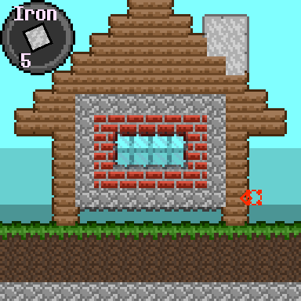
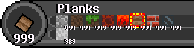

# I HONESTLY HAVE NO IDEA WHAT I'M GOING TO DO WITH THIS YET

This game is still very early in development, it's only *barely* not a block painter.

## Controls

**Left click** to Place block

**Right Click** to Break Block

**Q** and **E** to cycle between blocks

**M** to give 999 of everything

hold **TAB** to hide ui

**4** to toggle rendering air as a block

**5** to toggle music

**6**, **7**, and **8** to change background color

there are more things you can do with the other number keys, but they're kinda broken right now.

## To-do list

* 1 - add interactions between blocks
* 2 - make the world bigger than 16 blocks (and also change the name after that)
* 3 - add particles
* 4 - add liquids

### ***THIS IS A SIDE-PROJECT!!***

***Do not expect frequent updates.***
